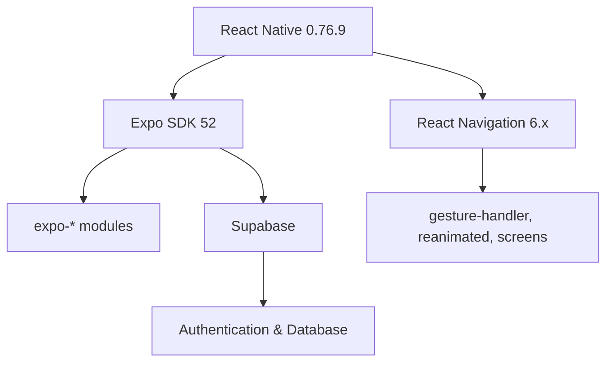

## Overview

CUCEIUbicate uses **89 production dependencies** and **6 development dependencies**. This page provides a comprehensive reference of all packages, their purposes, and versions.

## Core Framework

<Tabs>
  <Tab title="React & React Native">
    ```json package.json
    {
      "react": "^18.3.1",
      "react-native": "0.76.9",
      "react-dom": "^18.3.1",
      "react-native-web": "~0.19.13"
    }
    ```
    
    - **react**: Core React library for building UI components
    - **react-native**: Framework for building native mobile apps
    - **react-dom**: React rendering for web (used by Expo web)
    - **react-native-web**: React Native components for web platform
  </Tab>
  
  <Tab title="Expo">
    ```json package.json
    {
      "expo": "^52.0.48",
      "expo-dev-client": "~5.0.20",
      "eas-cli": "^16.20.1"
    }
    ```
    
    - **expo**: Main Expo SDK providing APIs and development tools
    - **expo-dev-client**: Custom development client for debugging
    - **eas-cli**: Expo Application Services command-line tool
  </Tab>
</Tabs>

## Navigation

<CodeGroup>
```json React Navigation Packages
{
  "@react-navigation/native": "^6.1.9",
  "@react-navigation/native-stack": "^6.9.17",
  "@react-navigation/drawer": "^6.6.6",
  "@react-navigation/bottom-tabs": "^6.5.11"
}
```

```json Navigation Dependencies
{
  "react-native-gesture-handler": "~2.20.2",
  "react-native-reanimated": "~3.16.1",
  "react-native-safe-area-context": "^4.12.0",
  "react-native-screens": "~4.4.0"
}
```
</CodeGroup>

### Navigation Packages Explained

<Accordion title="Core Navigation">
- **@react-navigation/native**: Core navigation library for React Native
- **@react-navigation/native-stack**: Native stack navigator (iOS/Android)
- **@react-navigation/drawer**: Drawer/sidebar navigation pattern
- **@react-navigation/bottom-tabs**: Bottom tab bar navigation
</Accordion>

<Accordion title="Navigation Support Libraries">
- **react-native-gesture-handler**: Touch gesture system for navigation
- **react-native-reanimated**: 60 FPS animations for navigation transitions
- **react-native-safe-area-context**: Safe area handling (notches, status bars)
- **react-native-screens**: Native screen components for better performance
- **react-native-drawer-layout**: Drawer layout implementation
</Accordion>

## Expo Modules

<Tabs>
  <Tab title="Media & Assets">
    ```json
    {
      "expo-av": "~15.0.1",
      "expo-video": "~2.0.1",
      "expo-image": "~2.0.7",
      "expo-font": "~13.0.3",
      "expo-media-library": "~17.0.6"
    }
    ```
    
    - **expo-av**: Audio and video playback (radio streaming)
    - **expo-video**: Modern video player component
    - **expo-image**: Optimized image component with caching
    - **expo-font**: Custom font loading
    - **expo-media-library**: Access device photo/video library
  </Tab>
  
  <Tab title="Storage & Security">
    ```json
    {
      "expo-secure-store": "~14.0.1",
      "expo-file-system": "~18.0.10",
      "@react-native-async-storage/async-storage": "^1.19.0"
    }
    ```
    
    - **expo-secure-store**: Encrypted storage for sensitive data
    - **expo-file-system**: File system access and operations
    - **async-storage**: Key-value storage for app data
  </Tab>
  
  <Tab title="System & Utilities">
    ```json
    {
      "expo-clipboard": "~7.0.1",
      "expo-crypto": "~14.0.2",
      "expo-linking": "~7.0.5",
      "expo-network": "~7.0.0",
      "expo-sharing": "~13.0.1",
      "expo-web-browser": "~14.0.2"
    }
    ```
    
    - **expo-clipboard**: Copy/paste functionality
    - **expo-crypto**: Cryptographic operations
    - **expo-linking**: Deep linking and URL handling
    - **expo-network**: Network status detection
    - **expo-sharing**: Native share dialog
    - **expo-web-browser**: In-app browser for external links
  </Tab>
  
  <Tab title="UI & Display">
    ```json
    {
      "expo-blur": "~14.0.1",
      "expo-linear-gradient": "~14.0.1",
      "expo-splash-screen": "^0.29.24",
      "expo-status-bar": "~2.0.0",
      "expo-system-ui": "~4.0.7",
      "expo-keep-awake": "~14.0.2"
    }
    ```
    
    - **expo-blur**: Blur effects for backgrounds
    - **expo-linear-gradient**: Gradient backgrounds
    - **expo-splash-screen**: Splash screen control
    - **expo-status-bar**: Status bar styling
    - **expo-system-ui**: System UI colors and appearance
    - **expo-keep-awake**: Prevent screen from sleeping
  </Tab>
  
  <Tab title="Configuration">
    ```json
    {
      "expo-build-properties": "~0.13.1",
      "expo-updates": "~0.27.4",
      "expo-modules-core": "~2.2.3"
    }
    ```
    
    - **expo-build-properties**: Native build configuration
    - **expo-updates**: Over-the-air updates
    - **expo-modules-core**: Core module infrastructure
  </Tab>
</Tabs>

## Backend & Data

<CodeGroup>
```json Backend Services
{
  "@supabase/supabase-js": "^2.39.8"
}
```

```json Database & Crypto
{
  "sqlite": "^5.1.1",
  "bcryptjs": "^2.4.3",
  "react-native-bcrypt": "^2.4.0",
  "react-native-crypto": "^2.2.1",
  "react-native-randombytes": "^3.6.2",
  "react-native-get-random-values": "^1.8.0"
}
```
</CodeGroup>

### Backend Packages Explained

- **@supabase/supabase-js**: Supabase client for authentication and database
- **sqlite**: Local SQLite database (if used for offline storage)
- **bcryptjs**: Password hashing and encryption
- **react-native-crypto**: Cryptographic functions
- **react-native-get-random-values**: Secure random number generation

## UI Components & Libraries

<Tabs>
  <Tab title="UI Libraries">
    ```json
    {
      "react-native-paper": "^5.12.3",
      "@gorhom/bottom-sheet": "^4.6.1",
      "react-native-modal-dropdown": "^1.0.2",
      "@react-native-picker/picker": "2.9.0"
    }
    ```
    
    - **react-native-paper**: Material Design component library
    - **@gorhom/bottom-sheet**: High-performance bottom sheet component
    - **react-native-modal-dropdown**: Dropdown select component
    - **@react-native-picker/picker**: Native picker component
  </Tab>
  
  <Tab title="Icons & Graphics">
    ```json
    {
      "@fortawesome/react-native-fontawesome": "^0.3.0",
      "@fortawesome/free-solid-svg-icons": "^6.5.1",
      "react-native-vector-icons": "^10.0.3",
      "react-native-svg": "15.8.0"
    }
    ```
    
    - **@fortawesome**: Font Awesome icon library (5000+ icons)
    - **react-native-vector-icons**: Additional icon sets
    - **react-native-svg**: SVG rendering for custom graphics
  </Tab>
  
  <Tab title="Animations">
    ```json
    {
      "lottie-react-native": "7.1.0",
      "react-native-animatable": "^1.4.0",
      "react-native-confetti-cannon": "^1.5.2"
    }
    ```
    
    - **lottie-react-native**: After Effects animations (splash screen)
    - **react-native-animatable**: Declarative animations
    - **react-native-confetti-cannon**: Celebration effects
  </Tab>
  
  <Tab title="User Input">
    ```json
    {
      "react-native-onboarding-swiper": "^1.3.0",
      "react-native-autocomplete-input": "^5.5.6",
      "@react-native-community/viewpager": "^5.0.11"
    }
    ```
    
    - **react-native-onboarding-swiper**: Onboarding screen carousel
    - **react-native-autocomplete-input**: Search autocomplete
    - **viewpager**: Swipeable page views
  </Tab>
</Tabs>

## Media & Image Handling

```json
{
  "react-native-image-pan-zoom": "^2.1.12",
  "react-native-image-zoom-viewer": "^3.0.1",
  "react-native-fs": "^2.20.0",
  "react-native-permissions": "^5.2.5"
}
```

- **react-native-image-pan-zoom**: Pinch-to-zoom for map image
- **react-native-image-zoom-viewer**: Full-screen image viewer
- **react-native-fs**: File system operations
- **react-native-permissions**: Runtime permission handling

## Chat & AI

```json
{
  "@google/generative-ai": "^0.21.0",
  "react-native-gifted-chat": "^2.6.4"
}
```

- **@google/generative-ai**: Google Gemini AI integration for chatbot
- **react-native-gifted-chat**: Feature-rich chat UI component

## Utilities

<CodeGroup>
```json Layout & Responsive
{
  "react-native-responsive-screen": "^1.4.2"
}
```

```json Polyfills
{
  "react-native-url-polyfill": "^2.0.0"
}
```
</CodeGroup>

- **react-native-responsive-screen**: Responsive sizing utilities
- **react-native-url-polyfill**: URL API polyfill for React Native

## Development Dependencies

```json
{
  "@babel/core": "^7.24.0",
  "@types/bcryptjs": "^2.4.2",
  "@types/react": "~18.3.12",
  "@types/react-native-get-random-values": "^1.8.2",
  "typescript": "^5.6.2"
}
```

<Accordion title="Development Tools">
- **@babel/core**: JavaScript compiler for React Native
- **typescript**: TypeScript support (tsconfig.json present)
- **@types/\***: TypeScript type definitions for various packages
</Accordion>

## Version Strategy

<Tabs>
  <Tab title="Exact Versions">
    Used for core dependencies to ensure stability:
    ```json
    {
      "react-native": "0.76.9",
      "@react-native-picker/picker": "2.9.0",
      "lottie-react-native": "7.1.0"
    }
    ```
  </Tab>
  
  <Tab title="Caret (^) Versions">
    Used for most packages - allows minor/patch updates:
    ```json
    {
      "react": "^18.3.1",
      "expo": "^52.0.48",
      "@supabase/supabase-js": "^2.39.8"
    }
    ```
  </Tab>
  
  <Tab title="Tilde (~) Versions">
    Used for Expo SDK packages - locks to SDK version:
    ```json
    {
      "expo-av": "~15.0.1",
      "expo-video": "~2.0.1",
      "react-native-reanimated": "~3.16.1"
    }
    ```
  </Tab>
</Tabs>

## Dependency Groups by Feature

### Campus Map Feature

```json
{
  "react-native-image-pan-zoom": "^2.1.12",
  "react-native-svg": "15.8.0",
  "@gorhom/bottom-sheet": "^4.6.1",
  "react-native-gesture-handler": "~2.20.2"
}
```

### Authentication System

```json
{
  "@supabase/supabase-js": "^2.39.8",
  "bcryptjs": "^2.4.3",
  "expo-secure-store": "~14.0.1",
  "@react-native-async-storage/async-storage": "^1.19.0"
}
```

### Radio Streaming

```json
{
  "expo-av": "~15.0.1",
  "expo-keep-awake": "~14.0.2"
}
```

### Video Routes

```json
{
  "expo-video": "~2.0.1",
  "expo-media-library": "~17.0.6"
}
```

### AI Chatbot

```json
{
  "@google/generative-ai": "^0.21.0",
  "react-native-gifted-chat": "^2.6.4"
}
```

## Platform-Specific Dependencies

<Accordion title="Android">
Some packages have Android-specific configurations:

- **expo-build-properties**: Configured for SDK 35, minSdk 24
- **react-native-permissions**: Requires manifest permission declarations
- Storage access permissions for media library
</Accordion>

<Accordion title="iOS">
iOS-specific considerations:

- **expo-media-library**: Requires NSPhotoLibraryAddUsageDescription
- Safe area handling with notched devices
- Apple App Store compliance requirements
</Accordion>

## Critical Dependency Relationships



## Installation Commands

<CodeGroup>
```bash Install All Dependencies
npm install
```

```bash Install Specific Package
npm install @supabase/supabase-js
```

```bash Update Expo SDK
expo upgrade
```
</CodeGroup>

## Known Issues & Warnings

<Accordion title="Reanimated Warnings">
The app suppresses Reanimated warnings in App.js:

```javascript
LogBox.ignoreLogs([
  "[Reanimated] Reading from `value` during component render."
]);
```

This is a known issue with React Native Reanimated and doesn't affect functionality.
</Accordion>

<Accordion title="Bcrypt Random Fallback">
Bcrypt warnings about Math.random are suppressed:

```javascript
LogBox.ignoreLogs([
  "Using Math.random is not cryptographically secure!"
]);
```

The app uses `react-native-get-random-values` for secure randomness.
</Accordion>

## Dependency Size Impact

**Approximate installed size:** ~800MB in node_modules

**Largest contributors:**
1. Expo SDK and modules (~200MB)
2. React Native core (~150MB)
3. Navigation libraries (~100MB)
4. UI components and icons (~80MB)
5. Media libraries (video, image) (~70MB)

## Update Strategy

<Tabs>
  <Tab title="Regular Updates">
    Safe to update frequently:
    - Development dependencies
    - Type definitions
    - Minor versions of stable packages
  </Tab>
  
  <Tab title="Cautious Updates">
    Test thoroughly before updating:
    - React Native version
    - Expo SDK version
    - Navigation libraries
    - Native modules with platform code
  </Tab>
  
  <Tab title="Locked Versions">
    Update only when necessary:
    - Lottie (animation files may need updates)
    - SVG rendering (affects map display)
    - Core navigation (breaking changes common)
  </Tab>
</Tabs>

---

**Related Documentation:**
- [Architecture](/development/architecture) - How dependencies are used
- [Project Structure](/development/project-structure) - Where code lives
