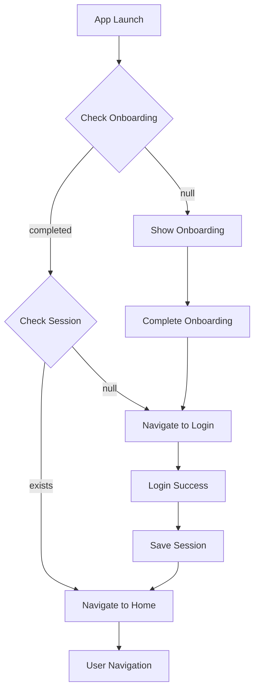
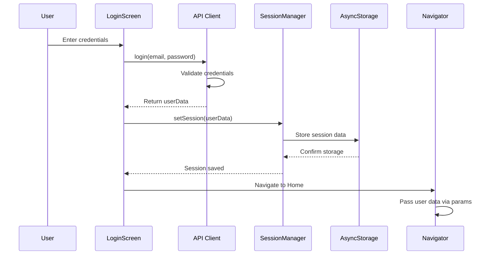
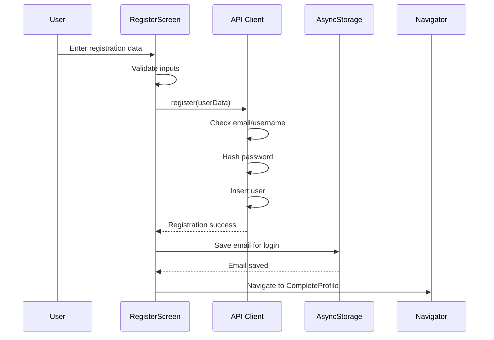

## Overview

CUCEIUbicate uses a combination of React hooks, AsyncStorage, and navigation parameters to manage application state. The state management strategy focuses on persistence, synchronization, and efficient data flow.

## State Architecture

<CardGroup cols={3}>
  <Card title="Local State" icon="react">
    Component-level state with React hooks
  </Card>
  <Card title="Persistent State" icon="floppy-disk">
    AsyncStorage for session and preferences
  </Card>
  <Card title="Navigation State" icon="route">
    Route parameters for data passing
  </Card>
</CardGroup>

## AsyncStorage Integration

### Storage Keys

CUCEIUbicate uses the following AsyncStorage keys:

<CodeGroup>
```javascript Storage Keys
// Session management
const SESSION_KEY = "userSession";

// Onboarding status
const ONBOARDING_KEY = "@onboarding_completed";

// Saved email for login
const SAVED_EMAIL_KEY = "@saved_email";
```
</CodeGroup>

### Session Storage

The SessionManager provides a centralized interface for session operations:

<CodeGroup>
```javascript Save Session
import AsyncStorage from "@react-native-async-storage/async-storage";

export const setSession = async (userData) => { 
  try {
    console.log('💾 === SAVING SESSION ===');
    console.log('📊 Data received:', JSON.stringify(userData, null, 2));
    
    // Validate minimum required data
    if (!userData || !userData.email || !userData.username) {
      throw new Error('Incomplete user data for session');
    }
    
    const sessionData = JSON.stringify(userData);
    await AsyncStorage.setItem("userSession", sessionData);
    
    console.log('✅ Session saved successfully');
    console.log('🔍 Verifying save immediately...');
    
    // Immediate verification
    const savedData = await AsyncStorage.getItem("userSession");
    if (savedData) {
      const parsedData = JSON.parse(savedData);
      console.log('✅ === VERIFICATION SUCCESSFUL ===');
      console.log('👤 Verified user:', parsedData.username);
      console.log('📧 Verified email:', parsedData.email);
      console.log('🎓 Verified code:', parsedData.code);
      return true;
    } else {
      console.log('❌ Error - could not save data');
      return false;
    }
  } catch (error) {
    console.error("🚨 Error saving session:", error);
    throw error;
  }
};
```

```javascript Get Session
export const getSession = async () => {
  try {
    console.log('🔍 === GETTING SESSION ===');
    
    const session = await AsyncStorage.getItem("userSession");
    
    if (session) {
      const userData = JSON.parse(session);
      console.log('✅ === SESSION FOUND ===');
      console.log('👤 User:', userData.username || userData.name);
      console.log('📧 Email:', userData.email);
      console.log('🎓 Code:', userData.code || userData.user_code);
      console.log('📊 Available data:', Object.keys(userData));
      return userData;
    } else {
      console.log('❌ No saved session');
      return null;
    }
  } catch (error) {
    console.error("🚨 Error getting session:", error);
    return null;
  }
};
```

```javascript Clear Session
export const clearSession = async () => {
  try {
    await AsyncStorage.removeItem("userSession");
    console.log("🗑️ Session deleted successfully");
  } catch (error) {
    console.error("🚨 Error deleting session:", error);
  }
};
```
</CodeGroup>

<Note>
The session manager includes immediate verification after saving to ensure data persistence succeeded. This is crucial for debugging session-related issues.
</Note>

## Application State

### App-Level State

The main App component manages global authentication state:

<CodeGroup>
```javascript App.js State
function App() {
  // Authentication state
  const [isFirstLaunch, setIsFirstLaunch] = useState(null);
  const [isLoggedIn, setIsLoggedIn] = useState(null);
  const [userSession, setUserSession] = useState(null);
  
  // UI state
  const [isLoading, setIsLoading] = useState(true);
  const [isLoginSuccess, setIsLoginSuccess] = useState(false);
  const [showSplash, setShowSplash] = useState(true);

  useEffect(() => {
    checkAppState();
  }, []);

  const checkAppState = async () => {
    try {
      console.log('🔍 Checking app state...');
      
      // 1. Check onboarding first
      const onboardingCompleted = await AsyncStorage.getItem("@onboarding_completed");
      console.log('📱 Onboarding completed:', onboardingCompleted);
      
      // If first time, show onboarding
      if (onboardingCompleted === null) {
        console.log('🎯 First time - showing onboarding');
        setIsFirstLaunch(true);
        setIsLoggedIn(false);
        return;
      }
      
      // 2. Check session after onboarding
      const session = await getSession();
      console.log('👤 Session found:', session ? 'YES' : 'NO');
      
      if (session) {
        console.log('✅ Logged in user:', session.username || session.name);
        setUserSession(session);
        setIsLoggedIn(true);
        setIsLoginSuccess(true);
        setIsFirstLaunch(false);
      } else {
        console.log('🔐 No session - go to login');
        setIsLoggedIn(false);
        setIsFirstLaunch(false);
      }
      
    } catch (error) {
      console.error("🚨 Error checking app state:", error);
      setIsFirstLaunch(true);
      setIsLoggedIn(false);
    }
  };

  return (
    // Conditional rendering based on state
  );
}
```
</CodeGroup>

### State Flow Diagram



## Component State Management

### Login Screen State

<CodeGroup>
```javascript LoginScreen State
export const LoginScreen = () => {
  // Form data
  const [formData, setFormData] = useState({
    username: "",
    password: "",
  });

  // UI state
  const [showError, setShowError] = useState(false);
  const [errorMessage, setErrorMessage] = useState("");
  const [showSuccessAnimation, setShowSuccessAnimation] = useState(false);
  const [modalVisible, setModalVisible] = useState(false);
  const [showPassword, setShowPassword] = useState(false);
  const [isLoading, setIsLoading] = useState(false);
  const [keyboardStatus, setKeyboardStatus] = useState(false);

  // Animations
  const shakeAnimation = useRef(new Animated.Value(0)).current;
  const loginBoxAnim = useRef(new Animated.Value(0)).current;
  const [bgAnim] = useState(new Animated.Value(0));
  const [floatingAnim] = useState(new Animated.Value(0));
  const logoPulseAnim = useRef(new Animated.Value(1)).current;

  // Load saved email on mount
  useEffect(() => {
    loadSavedEmail();
  }, []);

  const loadSavedEmail = async () => {
    try {
      const savedEmail = await AsyncStorage.getItem("@saved_email");
      if (savedEmail) {
        console.log('📧 Auto-loaded email:', savedEmail);
        setFormData(prev => ({
          ...prev,
          username: savedEmail
        }));
        await AsyncStorage.removeItem("@saved_email");
      }
    } catch (error) {
      console.error('Error loading saved email:', error);
    }
  };

  const handleInputChange = (field, value) => {
    setFormData((prev) => ({
      ...prev,
      [field]: value,
    }));
    setShowError(false);
  };
};
```
</CodeGroup>

### Register Screen State

<CodeGroup>
```javascript RegisterScreen State
export const RegisterScreen = () => {
  // Form data
  const [email, setEmail] = useState("");
  const [password, setPassword] = useState("");
  const [confirmPassword, setConfirmPassword] = useState("");
  
  // Validation state
  const [emailError, setEmailError] = useState(false);
  const [passwordError, setPasswordError] = useState(false);
  const [errorMsg, setErrorMsg] = useState("");
  
  // UI state
  const [showPassword, setShowPassword] = useState(false);
  const [isLoading, setIsLoading] = useState(false);
  const [modalVisible, setModalVisible] = useState(false);
  const [showSuccessAnimation, setShowSuccessAnimation] = useState(false);
  
  // Animations
  const [shakeAnimation] = useState(new Animated.Value(0));
  const [bgAnim] = useState(new Animated.Value(0));
  const [floatingAnim] = useState(new Animated.Value(0));

  // Validation configuration
  const allowedDomains = ["alumnos.udg.mx", "gmail.com"];
  const emailRegex = /^[\w-]+(\.[\ w-]+)*@([\w-]+\.)+[a-zA-Z]{2,7}$/;
  const passwordRegex = /^(?=.*[A-Z])(?=.*\d)(?=.*[@$!%*?&.,-_<>?¿¡!])(?=.{8,})/;
};
```
</CodeGroup>

## Navigation State

### Passing Data via Navigation

User data flows through the app via navigation parameters:

<CodeGroup>
```javascript Navigate with User Data
// After successful login
navigation.reset({
  index: 0,
  routes: [
    { name: "Principal Home", params: { user: result.userData } },
  ],
});
```

```javascript Receiving User Data
// In MyDrawer component
export const MyDrawer = () => {
  const route = useRoute();
  const { user } = route.params;

  return (
    <Drawer.Navigator initialRouteName="Mapa">
      <Drawer.Screen
        name="Mapa"
        component={HomePage}
        initialParams={{ user }}  // Pass to child screens
      />
      <Drawer.Screen
        name="Perfil"
        component={ProfileScreen}
        initialParams={{ user }}
      />
      {/* Other screens */}
    </Drawer.Navigator>
  );
};
```

```javascript Accessing User in Screens
// In any screen component
import { useRoute } from "@react-navigation/native";

const MyScreen = () => {
  const route = useRoute();
  const { user } = route.params || {};

  return (
    <View>
      <Text>Welcome, {user?.name}!</Text>
      <Text>Email: {user?.email}</Text>
      <Text>Code: {user?.code}</Text>
    </View>
  );
};
```
</CodeGroup>

<Warning>
Always use optional chaining (`user?.property`) when accessing navigation parameters to handle cases where the parameter might be undefined.
</Warning>

## State Persistence Patterns

### Onboarding State

<CodeGroup>
```javascript Mark Onboarding Complete
// After user completes onboarding
const completeOnboarding = async () => {
  try {
    await AsyncStorage.setItem("@onboarding_completed", "true");
    console.log('✅ Onboarding marked as complete');
    navigation.navigate('Login');
  } catch (error) {
    console.error('Error saving onboarding state:', error);
  }
};
```

```javascript Check Onboarding Status
const checkOnboarding = async () => {
  try {
    const completed = await AsyncStorage.getItem("@onboarding_completed");
    return completed !== null;
  } catch (error) {
    console.error('Error checking onboarding:', error);
    return false;
  }
};
```
</CodeGroup>

### Email Pre-fill

<CodeGroup>
```javascript Save Email for Next Login
// After successful registration
const saveEmailForLogin = async (email) => {
  try {
    await AsyncStorage.setItem("@saved_email", email);
    console.log('📧 Email saved for next login');
  } catch (error) {
    console.error('Error saving email:', error);
  }
};
```

```javascript Load and Clean
const loadSavedEmail = async () => {
  try {
    const savedEmail = await AsyncStorage.getItem("@saved_email");
    if (savedEmail) {
      setEmail(savedEmail);
      // Clean up after loading
      await AsyncStorage.removeItem("@saved_email");
    }
  } catch (error) {
    console.error('Error loading saved email:', error);
  }
};
```
</CodeGroup>

## Data Flow

### Authentication Flow



### Registration Flow



## State Synchronization

### Keeping Session in Sync

<CodeGroup>
```javascript Update Session After Profile Edit
const updateUserProfile = async (newData) => {
  try {
    // Update in backend
    await updateUser(userId, newData);
    
    // Get current session
    const session = await getSession();
    
    // Merge new data
    const updatedSession = {
      ...session,
      ...newData
    };
    
    // Save updated session
    await setSession(updatedSession);
    
    console.log('✅ Session synchronized with profile changes');
  } catch (error) {
    console.error('Error updating session:', error);
  }
};
```
</CodeGroup>

## Drawer State Management

### Active Item Tracking

<CodeGroup>
```javascript MyDrawer State
const CustomDrawerContent = (props) => {
  const navigation = useNavigation();
  const [isHelpModalVisible, setIsHelpModalVisible] = useState(false);
  const [activeItem, setActiveItem] = useState('Mapa');

  const handleNavigation = (screenName) => {
    setActiveItem(screenName);
    navigation.navigate(screenName);
  };

  return (
    <View>
      {drawerSections.map((section) => (
        <View key={section.title}>
          {section.items.map((item) => (
            <TouchableOpacity
              onPress={() => handleNavigation(item.name)}
              style={[
                styles.drawerItem,
                activeItem === item.name && styles.activeItem
              ]}
            >
              {/* Item content */}
            </TouchableOpacity>
          ))}
        </View>
      ))}
    </View>
  );
};
```
</CodeGroup>

## Performance Optimization

### Memoization

<CodeGroup>
```javascript useMemo for Expensive Computations
import { useMemo } from 'react';

const MyComponent = ({ userData }) => {
  // Memoize computed value
  const formattedName = useMemo(() => {
    return `${userData.name} ${userData.lastnames}`.toUpperCase();
  }, [userData.name, userData.lastnames]);

  // Memoize filtered list
  const activeUsers = useMemo(() => {
    return users.filter(user => user.isActive);
  }, [users]);

  return (
    <View>
      <Text>{formattedName}</Text>
    </View>
  );
};
```

```javascript useCallback for Functions
import { useCallback } from 'react';

const MyComponent = () => {
  // Memoize callback function
  const handlePress = useCallback(() => {
    console.log('Button pressed');
  }, []);

  // With dependencies
  const handleSubmit = useCallback((data) => {
    submitToAPI(data, userId);
  }, [userId]);

  return (
    <TouchableOpacity onPress={handlePress}>
      <Text>Press me</Text>
    </TouchableOpacity>
  );
};
```
</CodeGroup>

### Avoiding Unnecessary Renders

```javascript
// Use React.memo for expensive components
const ExpensiveComponent = React.memo(({ data }) => {
  return (
    <View>
      {/* Complex rendering logic */}
    </View>
  );
});

// Custom comparison function
const areEqual = (prevProps, nextProps) => {
  return prevProps.id === nextProps.id && 
         prevProps.name === nextProps.name;
};

const OptimizedComponent = React.memo(MyComponent, areEqual);
```

## Debugging State

### State Logging

<CodeGroup>
```javascript Console Logging
// Login state logging
const handleLogin = async () => {
  console.log('🔍 === LOGIN STATE DEBUG ===');
  console.log('Form data:', formData);
  console.log('Is loading:', isLoading);
  console.log('Show error:', showError);
  
  // After API call
  console.log('📊 API Result:', result);
  console.log('✅ Login success:', result.isMatch);
};
```

```javascript Session Debugging
const debugSession = async () => {
  try {
    const session = await getSession();
    console.log('📊 === SESSION DEBUG ===');
    console.log('Session exists:', !!session);
    console.log('Session data:', session);
    console.log('User ID:', session?.id);
    console.log('Username:', session?.username);
    console.log('Email:', session?.email);
    console.log('Code:', session?.code);
  } catch (error) {
    console.error('Session debug error:', error);
  }
};
```
</CodeGroup>

## Best Practices

<CardGroup cols={2}>
  <Card title="Initialize State" icon="play">
    Always initialize state with appropriate default values to prevent undefined errors.
  </Card>
  <Card title="Validate Storage" icon="check">
    Verify AsyncStorage operations succeeded by reading back the saved data.
  </Card>
  <Card title="Handle Null" icon="shield">
    Use optional chaining and nullish coalescing for safe property access.
  </Card>
  <Card title="Clean Up" icon="broom">
    Remove temporary AsyncStorage items after they've been used (like saved email).
  </Card>
</CardGroup>

## Related Files

- **Session Manager**: `Src/auth/SessionManager.js:4` (setSession), `Src/auth/SessionManager.js:41` (getSession)
- **App State**: `App.js:38` (state initialization), `App.js:50` (checkAppState)
- **Login State**: `Src/auth/LoginScreen.js:49` (formData state), `Src/auth/LoginScreen.js:196` (handleLogin)
- **Drawer State**: `Src/Screens/Home/Components/SearchBarsComponent/MyDrawer.js:74` (CustomDrawerContent)
